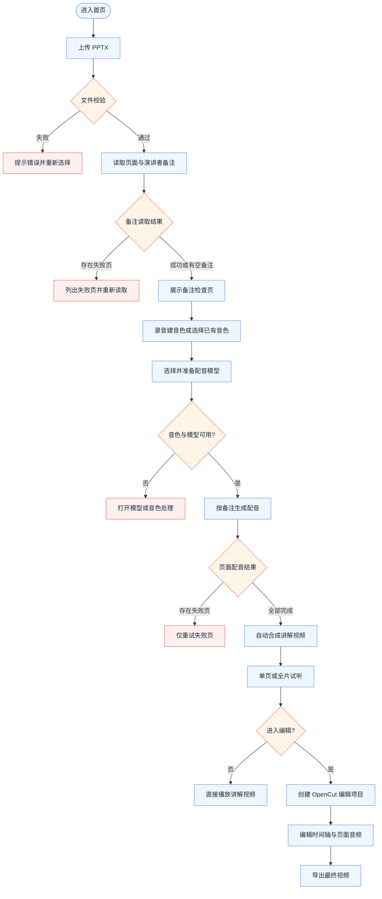
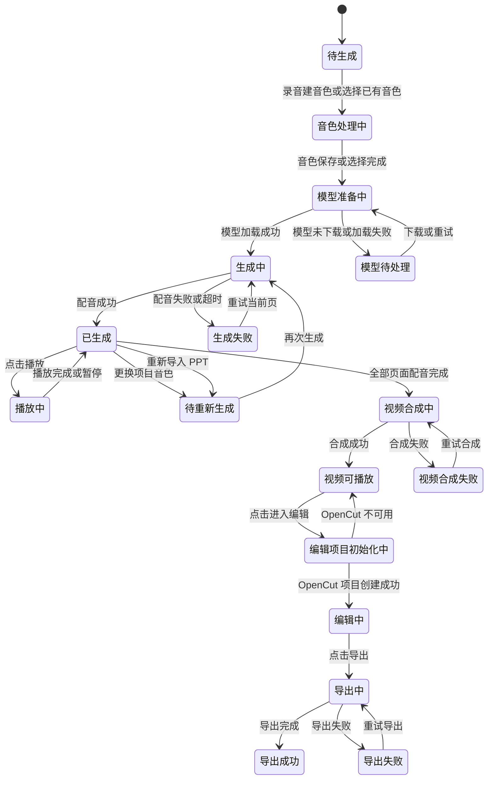
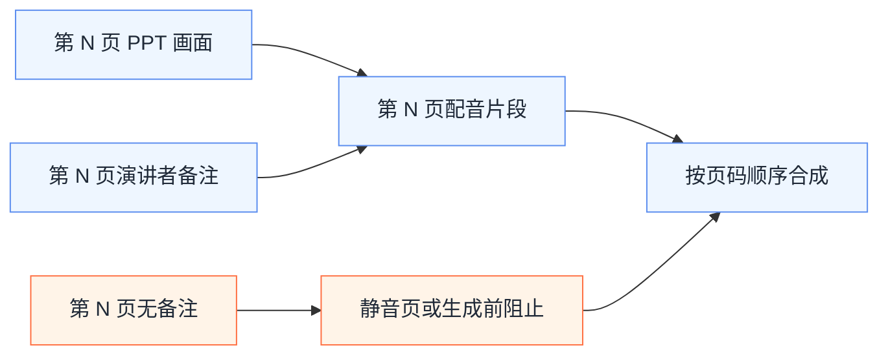

# 蝉镜 AI PPT 课件配音视频产品需求文档

> 文档性质：功能型 PRD
>
> 本次修订：在 V1.1 核心链路上加入 Voicebox 音色与模型管理、自动播放翻页讲解视频和 OpenCut 二次编辑导出。
>
> 分析依据：`reference_system_screenshot` 目录内 5 张参考截图。截图中的原有工作台仅作为界面风格和文件解析状态的参考，未被本期范围采纳的能力不纳入本 PRD。

## 0. PRD 类型判定

### 0.1 类型

本需求属于功能型 PRD，目标是将 PPT 页面作为视频画面，读取每页 PPT 备注作为口播文案，使用用户选择的配音音色生成与页面顺序对应的配音视频。

### 0.2 适用对象

• 课程制作人员：已有 PPT 课件和页面备注，希望快速生成带讲解音频的视频。

• 企业培训人员：将带有演讲者备注的培训课件转换为可播放的课程视频。

• 教师与内容运营人员：通过一个音色完成整套课件的统一配音，减少手工录音成本。

### 0.3 本期范围

• 导入 PPTX 课件并校验文件。

• 读取每页 PPT 的演讲者备注，按页面顺序展示读取结果。

• 选择一个项目级配音音色，并应用到全部有备注页面。

• 在线录音制作个人音色，管理个人音色档案，并选择、下载和管理配音模型。

• 按每页备注生成配音音频，支持单页试听和全片试听。

• 配音完成后自动以 PPT 页面作为画面，按音频时长自动播放和翻页，生成讲解视频。

• 讲解视频生成后进入 OpenCut 编辑器，支持时间轴、页面、音频和导出编辑。

• 自动保存导入文件、备注读取结果、音色选择和配音生成状态。

### 0.4 明确不做

| 不纳入本期的能力 | 处理方式 |
|---|---|
| 自动生成或改写口播文案 | 不提供 AI 文案生成，配音内容唯一来源为 PPT 备注 |
| 独立脚本文本输入 | 不提供空白脚本编辑器；用户需回到 PPT 修改备注后重新导入 |
| 字幕编辑与字幕样式 | 本期不生成、不编辑、不展示字幕 |
| PPT 页面编辑 | 不修改 PPT 页面内容、布局或页面顺序 |
| PPT 动画与切换效果还原 | 本期按静态页面处理，动画支持另行规划 |
| 其他视觉与音频编辑 | 不提供额外画面资源、配乐或轨道编辑 |
| 页面级多音色 | 一个项目只选择一个配音音色，不支持逐页切换音色 |
| 配音前的自由脚本编辑 | 不在本产品内改写 PPT 备注；需回到原 PPT 修改后重新导入 |

## 1. 项目背景与收益预估

### 1.1 需求简介

用户无需重新撰写脚本或逐页录音，只需上传包含演讲者备注的 PPTX，系统读取每页备注；用户可以在线录制个人音色或选择已有音色及模型，随后自动生成按页面顺序播放的讲解视频，并在 OpenCut 中继续编辑。

### 1.2 业务诉求

• 将 PPT 备注直接作为配音内容，避免系统生成文案与用户原始讲稿不一致。

• 保持 PPT 页面顺序和备注顺序一一对应，降低课件内容错位风险。

• 通过项目级音色选择保证整套课程的音色统一，减少配置项和操作成本。

• 支持在线录音制作个人音色，并通过模型管理降低首次使用时的配置门槛。

• 将产品从复杂的视频编辑工作台收敛为可快速完成的课件配音工具。

• 生成后保留页面和音频的可编辑结构，使用户可以修改页面时长、音频片段和成片输出。

### 1.3 收益预估

以下为本期建议目标，正式评审时需补充现有流程基线。

| 收益层级 | 指标 | 建议目标 |
|---|---|---|
| 用户收益 | 首次生成路径 | 从上传到提交配音不超过 3 个关键步骤：导入 PPT、确认备注、选择音色并生成 |
| 用户收益 | 备注读取准确率 | 页面顺序、页码和备注文本的对应准确率达到 100% |
| 用户收益 | 配音内容一致性 | 生成音频使用的文本必须与读取到的备注一致，不允许后台静默改写 |
| 用户收益 | 音色配置效率 | 用户完成项目级音色选择不超过 2 次点击；选择后默认应用到全部有备注页面 |
| 用户收益 | 个人音色制作 | 用户可完成录音、试听、保存和再次选择个人音色；录音失败时可重录 |
| 用户收益 | 模型可用性 | 用户可查看模型语言、能力和下载状态，模型缺失时不能进入无反馈的生成状态 |
| 业务收益 | 配音视频生成转化率 | 解析成功的课件中，提交生成配音视频的比例较现有流程提升 20% |
| 业务收益 | 生成成功率 | 通过生成前校验的项目，最终生成成功率 ≥ 95% |
| 业务收益 | 二次编辑使用率 | 成片生成后，至少 30% 的项目可以在编辑器中完成一次有效编辑并成功导出 |
| 不做风险 | 内容错误 | 备注读取不完整或页码错位会导致配音与课件画面不一致，影响课程准确性 |
| 不做风险 | 交付效率低 | 仍依赖人工录音和剪辑，课件更新后无法快速重新生成配音版本 |

### 1.4 核心业务规则

• PPT 页面是视频画面的唯一来源，系统不修改原页面内容。

• PPT 演讲者备注是配音文本的唯一来源，系统不自动补写、改写或扩写备注。

• 备注按 PPT 页面序号关联；第 N 页只使用第 N 页备注。

• 配音音色为项目级配置；用户确认后，所有有备注页面使用同一音色。

• 用户可以使用预置音色，也可以通过在线录音创建个人音色；个人音色必须经过试听和保存确认后才能用于生成。

• 配音模型与音色档案分开管理；模型未下载、未加载或与音色不兼容时，生成按钮不可用并展示处理入口。

• 无备注页面默认保留在视频中，但不生成配音；页面展示时长采用产品默认值，默认值待确认。

• 有备注页面的默认展示时长等于该页配音实际时长；页面切换发生在上一页音频播放完成时。

• 讲解视频必须保留页面顺序、页面与音频的页码关联和音频来源，供后续编辑器使用。

• OpenCut 编辑修改只影响编辑项目和导出结果，不覆盖原始 PPT、备注文本和 Voicebox 生成的原始音频。

• 备注读取失败的页面不能静默当作“无备注”，必须显示“读取失败”并阻止全片生成，除非用户重新导入并成功读取。

## 2. 业务流程简述

### 2.1 主流程

1. 用户进入“PPT 课件配音视频”首页。
2. 用户选择并上传一个 PPTX 文件。
3. 系统校验文件并解析 PPT 页面及每页演讲者备注。
4. 系统展示页面列表、备注读取状态、备注字数和预计配音时长。
5. 用户检查备注读取结果，确认页面顺序和有无备注页面。
6. 用户进入 Voicebox 音色工作区，选择已有音色，或在线录音制作并保存个人音色。
7. 用户选择配音模型，若模型未下载则先下载、校验并加载模型。
8. 用户点击“按备注生成配音”，系统按页面顺序生成配音音频。
9. 音频生成完成后，系统自动将 PPT 页面与配音音频合成为讲解视频，并在音频结束时自动翻页。
10. 用户可试听当前页面或全片；若发现备注错误，返回 PPT 修改备注后重新导入。
11. 用户点击“进入编辑”，将可编辑项目交给 OpenCut，修改后导出最终视频。
12. 生成或导出失败时保留原始项目、页面音频和编辑项目，并提供重试。

### 2.2 分支流程

• PPT 没有任何备注：系统展示“未读取到备注”，不生成配音，禁止直接提交全片生成，并引导用户返回 PPT 添加备注后重新导入。

• 只有部分页面有备注：有备注页面正常生成配音；无备注页面保留为静音页并显示明确状态。是否允许包含静音页由生成前开关控制，默认允许，具体默认值待确认。

• 备注读取部分失败：系统列出失败页码和原因，禁止生成配音，提供重新解析入口。

• 用户重新导入 PPT：新文件作为新版本解析；在覆盖当前项目前二次确认，确认后清除旧页面、备注和音频状态。

• 用户切换音色：已生成音频标记为“待重新生成”，不自动使用旧音色音频冒充新音色结果。

• 用户创建个人音色：首次使用需要获得麦克风权限，录音完成后可试听、重录、保存或取消；未保存的录音不得出现在可选音色列表。

• 模型未下载：系统将用户引导至模型管理，展示下载进度、剩余空间和取消入口；模型下载完成并加载成功后才允许生成。

• 视频自动合成完成：默认直接进入讲解视频预览；用户可以选择“进入编辑”打开 OpenCut 编辑项目。

• OpenCut 编辑器不可用或接入版本不兼容：保留可播放的讲解视频，提示“编辑器暂不可用”，不得阻止原视频播放。

## 3. 版本管理

### 3.1 PRD 文档自身修订记录

| 版本号 | 日期 | 修订人 | 修订内容 |
|---|---|---|---|
| V1.0 | 2026-07-18 | 产品经理 | 基于参考截图整理原始产品功能范围 |
| V1.1 | 2026-07-18 | 产品经理 | 收敛为 PPT 备注配音链路，删除无关编辑和素材能力 |
| V1.2 | 2026-07-18 | 产品经理 | 增加 Voicebox 录音建音色、模型管理、自动翻页讲解视频和 OpenCut 二次编辑要求 |

### 3.2 产品版本信息

| 项目 | 内容 |
|---|---|
| 所属产品 | 蝉镜AI PPT 课件配音视频 |
| 所属平台/车型 | 不适用，当前按桌面网页产品规划 |
| PRD 评审版本 | V1.2 |
| 目标上线版本 | 待确认 |
| 兼容最低硬件版本 | 不适用；建议优先支持桌面端主流浏览器 |
| 依赖模块及基线 | PPTX 文件解析、演讲者备注读取、Voicebox 音色与模型、TTS 配音、页面与音频合成、OpenCut 编辑器、项目保存 |
| 本期范围 | 导入 PPTX、读取备注、在线录音建音色、选择/下载模型、生成配音、自动翻页讲解视频、OpenCut 编辑与导出 |
| 后续范围 | PPT 动画、字幕、多音色、音乐、批量处理、云端协作和更多输出格式 |

## 4. 系统关联与依赖

### 4.1 依赖模块列表

| 依赖模块 | 依赖内容 | 失败时的业务表现 |
|---|---|---|
| 文件导入 | 接收 PPTX 并展示文件信息 | 格式不支持或文件损坏时阻止解析并提示原因 |
| PPT 页面解析 | 读取页面数量、页码、页面画面和页面顺序 | 页面解析失败时不得进入可生成状态 |
| PPT 备注读取 | 读取每页演讲者备注并与页码绑定 | 读取失败的页码必须单独展示并支持重新解析 |
| 配音音色库 | 返回可选音色、音色名称、语言和试听样例 | 音色列表加载失败时保留已选音色并提供重试 |
| Voicebox 音色工作区 | 在线录音、音色档案、音色试听、保存和删除 | 麦克风权限或录音失败时提供明确提示和重录 |
| Voicebox 模型管理 | 查看、下载、取消、删除、加载和卸载配音模型 | 模型未准备好时阻止生成并保留当前项目 |
| Voicebox TTS 配音 | 使用备注原文、音色档案和选定模型生成页面音频 | 单页失败可重试；失败页阻止视频生成 |
| 讲解视频合成 | 将原 PPT 页面和页面配音按页码合成为自动翻页视频 | 合成失败时保留全部页面和音频结果并提供重试 |
| OpenCut 编辑器 | 接收页面与音频的可编辑时间轴并支持成片编辑导出 | 编辑器不可用时仍保留讲解视频预览 |
| 项目保存 | 保存文件、备注、音色和音频状态 | 保存失败时显示未保存，恢复网络后自动重试 |

### 4.2 数据流说明

```mermaid
flowchart LR
    A[用户上传 PPTX] --> B[文件校验]
    B -->|通过| C[读取页面与演讲者备注]
    B -->|失败| X[提示文件错误]
    C --> D{备注读取结果}
    D -->|全部成功或存在空备注| E[展示页面备注列表]
    D -->|存在读取失败| F[展示失败页并禁止生成]
    E --> G[进入 Voicebox 音色工作区]
    G --> H[录音建音色或选择已有音色]
    H --> I[选择并准备配音模型]
    I --> J[按页使用备注原文生成配音]
    J --> K{配音结果}
    K -->|成功| L[自动翻页合成讲解视频]
    K -->|失败| M[标记失败页并重试]
    L --> N[视频预览]
    N --> O[进入 OpenCut 编辑]
    O --> P[编辑时间轴与页面音频]
    P --> Q[导出最终视频]
    classDef action fill:#eef6ff,stroke:#5b8def,color:#1f2937;
    classDef decision fill:#fff4e8,stroke:#ff7043,color:#1f2937;
    classDef error fill:#fff0f0,stroke:#e55b5b,color:#1f2937;
    class A,B,C,E,G,H,I,J,L,N,O,P,Q action;
    class D,K decision;
    class F,M,X error;
```

### 4.3 业务接口契约

下表只定义业务输入、输出和用户可感知行为，不限定底层实现。

| 业务接口 | 主要输入 | 主要输出 | 超时/重试建议 |
|---|---|---|---|
| 导入 PPTX | 文件、项目标识 | 文件名、文件大小、文件状态 | 文件校验即时返回；网络异常可重新选择文件 |
| 读取备注 | 文件标识、页面范围 | 页码、页面画面、备注原文、备注状态、字数 | 8 秒无响应显示处理中；失败可整文件重试 |
| 获取音色与档案 | 用户身份、语言筛选 | 音色标识、名称、语言、试听样例、可用状态、是否个人音色 | 失败显示重试；已选音色不清空 |
| 创建个人音色 | 录音文件、音色名称、授权确认、音色描述 | 音色档案标识、处理状态、试听地址 | 麦克风或处理失败支持重录和重试；未保存档案不可使用 |
| 获取与下载模型 | 模型标识、平台、语言、下载操作 | 模型版本、大小、能力、下载进度、加载状态 | 支持取消、继续、重试；空间不足明确提示 |
| 生成页面配音 | 页面标识、备注原文、项目音色、模型标识、语言 | 音频状态、音频时长、失败原因、生成版本 | 8 秒无响应显示处理中；支持失败页重试 |
| 自动保存 | 项目变更内容 | 保存状态、最近保存时间 | 用户停止操作 1 秒后触发；失败后自动重试 |
| 合成讲解视频 | 页面画面、页面音频、页面顺序、静音页规则 | 生成任务状态、成片播放地址、页码时间关系或失败原因 | 防重复提交；任务失败支持重试 |
| 创建 OpenCut 项目 | 页面素材、页面音频、页码关联、视频画面比例 | 编辑项目标识、时间轴、素材映射关系 | 编辑器不可用时回退视频预览；创建失败可重试 |
| 编辑与导出 | 编辑项目、时间轴变更、导出参数 | 编辑项目版本、导出任务状态、最终视频地址 | 导出失败支持重试；不覆盖原始讲解视频 |

### 4.4 数据对象规则

| 数据对象 | 必填信息 | 展示规则 |
|---|---|---|
| 项目 | 项目标识、文件名、解析状态、音色标识 | 顶部展示项目名称和保存状态 |
| 页面 | 页码、页面画面、页面顺序、备注状态 | 按 PPT 原始顺序展示，不允许在本期内拖拽排序 |
| 备注 | 页码、原文、字符数、预计时长 | 保留段落换行；超长内容在列表中滚动或折叠展示 |
| 音色档案 | 音色标识、名称、语言、来源、授权状态、可用状态 | 个人音色与预置音色明确区分；未完成授权的档案不可生成 |
| 配音模型 | 模型标识、版本、语言、能力、下载状态、加载状态 | 展示已下载、下载中、未下载、加载中、不可用 |
| 配音 | 页码、音色标识、模型标识、生成状态、音频时长 | 音色或模型切换后旧音频标记为待重新生成 |
| 讲解视频 | 页面顺序、页码时间关系、音频关联、静音页规则、生成状态 | 自动翻页播放；保留页面和音频映射供编辑器使用 |
| 编辑项目 | 原始视频标识、页面素材、音频素材、时间轴、编辑版本 | OpenCut 编辑项目与原始讲解视频分离保存 |
| 成片 | 页面顺序、编辑版本、导出参数、生成状态 | 支持预览和导出；导出结果不得覆盖原始版本 |

### 4.5 兼容性与耦合度

• 文件兼容：本期仅确认支持 `.pptx`；`.ppt`、PDF、图片、加密文件和超大文件待确认。

• 备注来源：只读取 PPT 文件中的演讲者备注，不读取文件名、页面正文或其他隐藏文本作为配音内容。

• 页面画面：按页面静态画面合成；PPT 动画、页面切换和嵌入媒体不在本期处理。

• 配音服务：音色和 TTS 不可用时，不允许生成错误音频；已解析的 PPT 和备注仍可查看。

• 项目保存：保存服务不得阻塞备注查看和已有音频试听；保存失败时必须给出明确未保存状态。

### 4.6 技术选型要求

#### 4.6.1 Voicebox 音频生成与音色工作区

• 指定依赖：[jamiepine/voicebox](https://github.com/jamiepine/voicebox)。Voicebox README 当前公开能力包括本地优先运行、应用内录音创建音色、音色档案管理、多 TTS 引擎、模型下载/卸载、异步生成队列和 REST API；接入时必须以锁定的发布版本或提交为基线，不允许直接依赖随时变化的 `main` 分支。

• 接入方式：产品侧通过 Voicebox 适配层调用其本地 REST API 或等价的稳定接口。适配层必须隔离音色、模型、生成任务和错误码，产品页面不得直接依赖某一个 TTS 引擎的字段。

• API 映射：Voicebox 当前公开示例包含音色档案查询、文本生成和语音调用接口；本产品至少需要映射为“健康检查、音色档案查询/创建、模型查询/下载、按备注生成音频、任务状态查询、结果获取”六类业务接口。具体路径和参数以锁定版本为准，不得把 README 示例路径直接当作长期契约。

• 最小能力：适配层至少覆盖健康检查、音色列表、个人音色创建、音色试听、模型列表、模型下载状态、页面配音生成、任务进度、失败重试和生成结果查询。

• 个人音色录制：提供麦克风权限申请、录音开始、暂停、继续、停止、试听、重录、保存、取消和删除；录音前展示用途和授权确认，录音文件不得在未确认时上传或加入公共音色列表。

• 录音质量检查：至少检查是否存在有效音频、录音时长是否满足模型要求、音量是否过低、是否存在明显持续噪声。质量不合格时指出具体原因并允许重录；最小时长、音频格式和噪声阈值需以 Voicebox 选定模型的实际要求为准，不能在产品层写死未验证数值。

• 音色档案：支持名称、语言、描述、创建时间、来源、授权状态和最近使用时间；个人音色默认仅当前用户可见，支持删除和导出备份，导出文件是否允许跨设备导入待确认。

• 模型选择：用户可查看模型名称、版本、语言、支持的音色能力、预计下载大小、已占用空间、运行设备和当前状态；默认推荐模型必须说明推荐原因。

• 模型下载：支持开始、暂停、继续、取消、失败重试、删除和加载；显示进度、速度、剩余空间、预计剩余时间和模型状态。删除正在使用的模型前必须提示会影响哪些项目。

• 模型加载：生成前检查模型已下载、完整、加载成功且与所选音色和语言兼容；不兼容时阻止生成并提供替换音色或模型入口，不允许静默切换模型。

• 生成任务：按页面建立可追踪任务，支持排队、处理中、成功、失败、取消和恢复；每一页必须记录使用的音色、模型、备注原文、生成版本、音频时长和错误原因。

• 长文本：优先使用 Voicebox 已提供的句子切分、分段生成和交叉淡化能力；产品必须确保分段边界不丢字、不重复，中文标点和英文缩写不被错误切分。单页最大字数和分段上限需在接入测试中确定。

• 隐私与合规：Voicebox 的本地优先能力不得被产品改造成默认上传个人录音；必须提供数据删除、录音用途说明、授权记录和本地缓存清理入口。个人音色仅可用于已授权项目。

#### 4.6.2 自动讲解视频合成

• 配音生成成功后自动触发视频合成，不要求用户额外手动拖动页面和音频。

• 视频合成使用 PPT 页面静态画面和对应页面音频；第 N 页画面只绑定第 N 页音频。

• 有配音页面的展示时长默认等于该页最终音频时长；页面切换点必须设置在音频播放完成后，不能按固定默认时长提前切页。

• 无备注页面按静音页规则处理：默认保留页面并使用默认展示时长，或在用户关闭静音页允许项时阻止生成；具体默认时长待确认。

• 自动播放：视频播放时按页面顺序播放，音频结束后自动切换下一页；播放头、当前页码、总时长和页面进度必须同步。

• 合成输出必须同时保存两个结果：可直接播放的扁平视频，以及供 OpenCut 编辑的页面素材、音频素材和页码时间映射。只保存扁平视频不能作为本期接入方案。

• 生成任务必须支持进度、取消、失败重试和断点恢复；失败时定位到具体页面或音频，不清除已完成资产。

#### 4.6.3 OpenCut 二次编辑与导出

• 指定依赖：[OpenCut-app/OpenCut](https://github.com/OpenCut-app/OpenCut)。该仓库当前 README 标注为重写中，编辑器 API、插件体系和跨端能力仍在建设；因此正式接入前必须完成最小可行验证，并锁定可用提交或发布版本。

• 仓库状态差异：OpenCut README 同时将当前可用版本指向历史代码库，而历史代码库已标注为归档；项目评审必须明确采用主仓库的哪个提交、受控分支或自行维护的分支，不得默认切换到历史代码库。

• 版本风险控制：不得将 OpenCut 的未稳定 `main` 直接作为生产依赖。若目标提交尚未提供稳定的编辑器接入接口，需通过适配层或受控分支接入，且必须保留替换编辑器的能力。

• 导入方式：优先导入页面素材、页面音频和时间轴映射，而不是只导入已经合成的单一视频文件；这样才能编辑页面时长、页面顺序和单页音频。

• 最小编辑能力：播放/暂停、播放头拖动、时间轴缩放、页面片段选择、页面片段移动、页面时长调整、页面删除、页面复制、页面排序、音频片段选择、音频裁剪、音频分割、音量调整、静音、淡入淡出、撤销和重做。

• 页面编辑约束：编辑器中的页面调整只改变编辑项目；原始 PPT 页面、备注和 Voicebox 原始音频必须保留。删除页面前二次确认，删除后支持撤销。

• 音频编辑约束：音频裁剪、分割、音量和淡入淡出只改变编辑版本；如果用户需要重新生成内容，必须回到备注和 Voicebox 生成流程，不能把剪辑结果反写为新的备注。

• 同步规则：用户移动或裁剪页面时，页面与对应配音的映射必须可见；禁止产生“画面属于第 N 页、音频属于第 M 页”的无提示错配。

• 预览与导出：编辑器应支持实时预览、导出前校验、导出进度、取消、失败重试和导出完成后的播放。默认输出格式建议为 MP4，编码规格、分辨率和帧率待确认。

• 编辑器不可用降级：仍可播放自动合成的讲解视频，并提供“稍后编辑”入口；OpenCut 初始化失败不得导致原始项目或已生成音频丢失。

#### 4.6.4 开源依赖治理

• 记录 Voicebox 和 OpenCut 的仓库地址、版本号或提交号、许可证、依赖变更和构建方式。

• 当前公开资料显示两个仓库均采用 MIT License，但上线前仍需以锁定版本中的 LICENSE 文件和依赖树复核，不得只依据网页说明。

• 对个人录音、音色模型、PPT 课件和生成视频分别定义存储位置、删除策略、备份策略和访问权限。

• 第三方依赖升级必须经过音色创建、模型下载、单页配音、自动翻页、编辑和导出全链路回归，不允许只验证页面能打开。

• 必须保留不依赖第三方编辑器的原始讲解视频和页面级音频资产，保证编辑器替换或升级时可以重新建项目。

## 5. 详细功能说明

### 5.1 功能一：PPTX 导入与文件校验

#### 5.1.1 位置

首页主区域，步骤一“导入 PPT”。

#### 5.1.2 目标

让用户导入一个 PPTX 文件，并在解析前明确文件是否可用。

#### 5.1.3 界面元素与展示规则

• 页面标题建议为“PPT 课件配音视频”。

• 页面步骤提示为“导入 PPT → 读取备注 → 选择音色并生成配音”。

• 文件卡片展示 PPT 图标、文件名、文件大小和校验状态。

• 选择文件后主按钮显示“读取 PPT 备注”；未选择文件时按钮不可点击。

• 文件大小使用实际文件大小展示；当前截图中的 `406.03KB` 仅为示例，不作为限制值。

• 同一项目只允许一个当前 PPT 文件。重新选择文件时，若已有解析或配音内容，必须先确认覆盖。

#### 5.1.4 交互规则

• 支持点击选择文件；是否支持拖拽导入待确认。

• 选择文件后先校验扩展名和文件可读取性，再显示“可解析”。

• 点击“读取 PPT 备注”后进入解析状态，按钮显示处理中并禁止重复点击。

• 解析成功后自动进入备注检查页；不在首页执行配音生成。

#### 5.1.5 异常与边界

• 非 PPTX 文件：提示“仅支持 PPTX 文件，请重新选择”。

• 文件损坏或无法读取：提示“文件无法读取，请检查文件后重试”。

• 文件超出上限：提示实际限制值；限制值待确认，不得用截图示例大小代替。

• 网络异常：保留已选择文件，提示“网络异常，请检查网络后重试”。

• 用户在解析中返回：显示二次确认；确认返回后取消当前解析任务，未确认则继续解析。

### 5.2 功能二：读取 PPT 演讲者备注

#### 5.2.1 位置

课件解析完成后的备注检查页或工作台主区域。

#### 5.2.2 目标

按 PPT 页码读取演讲者备注，并让用户在生成配音前确认备注是否完整、是否与页面对应。

#### 5.2.3 读取规则

• 读取每页 PPT 的演讲者备注原文，保留段落顺序和换行关系。

• 备注以页面序号绑定：第 1 页备注只绑定第 1 页画面，不允许因空备注导致后续页面错位。

• 只读取备注文本，不读取页面正文、文件名、批注或隐藏对象作为口播内容。

• 备注列表按 PPT 原始顺序展示，至少显示页码、页面缩略图、备注状态、字数和预计配音时长。

• 备注文本默认只读，不提供独立脚本编辑、AI 改写或补全文案入口。

• 备注过长时在列表内换行或滚动展示，不截断实际用于配音的文本；单页可支持的最大字符数待确认。

#### 5.2.4 备注状态

| 状态 | 展示文案 | 是否允许生成 |
|---|---|---|
| 读取成功且有内容 | “已读取” | 允许 |
| 读取成功但为空 | “无备注” | 按静音页规则处理 |
| 读取失败 | “读取失败” | 不允许，需重新读取 |
| 备注过长 | “内容超出限制” | 不允许，需回到 PPT 修改后重新导入 |
| 页面解析失败 | “页面读取失败” | 不允许，需重新导入 |

#### 5.2.5 交互规则

• 点击页面缩略图查看页面画面与完整备注。

• 支持按“全部、已读取、无备注、读取失败”筛选，筛选只改变显示，不改变页面顺序。

• 提供“重新读取备注”入口；重新读取前提示会刷新当前备注状态和预计时长。

• 用户发现备注错误时，提示“请在原 PPT 中修改演讲者备注后重新导入”，不在本产品内直接编辑。

• 全部页面解析完成后，才允许进入音色选择步骤；存在读取失败页面时按钮不可点击。

#### 5.2.6 空数据与异常

• 所有页面均无备注：显示空状态“未读取到 PPT 备注”，提供“重新导入 PPT”按钮，并禁止生成配音。

• 部分页面无备注：显示无备注页数量和页码；默认保留页面，是否生成静音页由生成前规则控制。

• 备注读取超时：8 秒无响应显示“仍在读取备注”，超过产品任务超时阈值后提供重试；总超时阈值待确认。

### 5.3 功能三：Voicebox 音色工作区

#### 5.3.1 位置

备注检查完成后的步骤三，进入“配音音色”区域后打开 Voicebox 音色工作区。

#### 5.3.2 目标

让用户选择已有音色，或在线录音创建可复用的个人音色，并在生成前确认音色效果。

#### 5.3.3 界面元素

• 展示当前音色名称、语言、音色状态和进入音色列表的按钮。

• 音色列表展示音色名称、语言、适用场景和试听按钮；截图中可见“知心姐姐”作为示例音色名称，不能视为固定默认值。

• 提供音色搜索或语言筛选的具体形式待确认；如果音色数量较少，可只展示一次性列表。

• 每个音色提供试听样例，试听文本使用系统固定示例，不读取用户 PPT 备注。

#### 5.3.4 在线录音制作个人音色

• 点击“创建我的音色”打开录音弹窗，首次使用先申请麦克风权限并展示录音用途、保存位置和授权确认。

• 录音弹窗提供开始、暂停、继续、停止、试听、重录、保存和取消按钮；未开始录音时“停止”和“保存”不可点击。

• 录音过程中展示录音时长、输入音量和麦克风状态；持续无声音或音量过低时给出轻提示。

• 停止后先进行质量检查，检查有效音频、时长、音量、持续噪声和文件完整性；质量不合格时说明原因并引导重录。

• 用户填写音色名称、语言和描述后点击“保存音色”；保存成功后加入“我的音色”，并提供试听入口。

• 用户取消或关闭弹窗时，若存在未保存录音，必须二次确认；确认放弃后删除临时录音。

• 录音文件默认保存在本地 Voicebox 数据目录或产品指定的本地安全目录；是否允许云端备份待确认。

#### 5.3.5 音色档案管理

• 个人音色支持试听、重命名、查看授权信息、导出备份和删除；删除前二次确认，删除后不影响已经导出的成片。

• 未完成处理的音色显示“处理中”，不可用于配音；处理失败显示失败原因和重试/重录入口。

• 个人音色默认只对当前用户可见；不得自动加入公共列表或被其他项目访问。

#### 5.3.6 选择与切换规则

• 用户点击音色卡片后，显示选中态；同一时刻只能选中一个音色。

• 用户点击试听后只播放样例，不改变当前已选音色。

• 用户更换已生成配音的音色时，弹窗提示“更换音色后需要重新生成全部配音”，确认后将所有音频状态改为“待重新生成”。

• 未选择音色时，“按备注生成配音”不可点击；未生成音频前不显示视频合成入口。

• 音色一旦确认，默认应用于全部有备注页面；本期不提供逐页音色配置。

#### 5.3.7 异常与权限

• 音色列表加载失败：展示“音色加载失败”和重试按钮；已选音色不清空。

• 音色不可用：已选音色显示不可用原因，阻止生成并提供替换入口。

• 音色试听失败：只影响试听，不影响音色选择；提示“试听失败，请重试”。

• 麦克风权限被拒绝：展示系统权限引导，不允许进入录音状态；用户仍可选择已有音色。

• 录音设备断开：立即停止录音并保存已录制的临时片段，提示重新连接设备后重录或继续。

• 本期不设计会员音色或额外购买逻辑；如后续增加，需单独补充权益规则。

#### 5.3.8 配音模型选择与下载

• 音色确认后展示当前语言可用的配音模型，至少显示模型名称、版本、语言、能力、下载大小、运行设备和状态。

• 模型状态包括“未下载”“下载中”“已下载”“加载中”“可用”“不可用”；只有“可用”模型可以进入配音生成。

• 用户点击未下载模型时打开模型详情，展示模型说明、预计占用空间和所需运行条件，确认后开始下载。

• 下载支持暂停、继续、取消、失败重试和删除；下载中显示进度、速度、剩余空间和预计剩余时间。

• 删除正在使用的模型前必须提示受影响的项目；删除后项目保留音色和备注，但配音状态改为“待模型恢复”。

• 模型加载失败时提供重试、切换可用模型和查看诊断信息入口；不允许未经用户确认自动切换模型。

### 5.4 功能四：按 PPT 备注生成页面配音

#### 5.4.1 位置

音色确认后的操作区，主按钮“按备注生成配音”。

#### 5.4.2 目标

使用每页 PPT 备注原文、项目级音色和已加载配音模型，按页面顺序生成对应音频。

#### 5.4.3 生成规则

• 生成文本必须等于备注读取结果；不做自动改写、润色、扩写、删减或敏感词替换提示之外的内容变化。

• 有备注页面逐页生成音频；无备注页面不生成音频并标记为“静音页”。

• 页面配音生成完成后记录音频时长，预计时长按照实际音频时长更新。

• 页面生成顺序与 PPT 页面顺序一致；单页失败不影响其他页面完成，但全片生成前必须处理所有失败页。

• 生成按钮点击后进入“生成中”，按钮防重复点击；支持查看已完成页数和失败页数。

• 生成任务进入 Voicebox 队列，展示排队、处理中、成功、失败、取消和恢复状态；同一项目不得同时提交重复任务。

• 生成前再次检查音色档案和模型状态；检查失败时定位到具体音色或模型并阻止提交。

#### 5.4.4 生成状态

| 状态 | 页面表现 | 用户操作 |
|---|---|---|
| 未生成 | 显示“待生成” | 可选择音色或开始生成 |
| 生成中 | 显示进度和当前页码 | 可取消未开始页面，具体是否支持取消待确认 |
| 已生成 | 显示音频时长和播放按钮 | 可试听或重新生成 |
| 失败 | 显示失败原因和“重试” | 仅重试失败页 |
| 待重新生成 | 音色或备注发生变化后显示 | 重新生成对应页面 |

#### 5.4.5 异常与降级

• TTS 服务超时：8 秒无响应显示处理中；超过任务超时阈值后标记失败并提供重试。

• 单页配音失败：保留失败页备注、音色和模型，不回退为其他音色或空音频。

• 网络中断或 Voicebox 服务断开：暂停未完成任务；恢复后查询任务状态，能恢复则继续，不能恢复则仅重试未完成页。

• 备注在解析后发生变化：当前项目不允许直接编辑备注；用户重新导入后，旧音频标记为旧版本并要求重新生成。

### 5.5 功能五：单页与全片试听

#### 5.5.1 位置

备注页面列表和配音结果区域。

#### 5.5.2 目标

让用户确认备注、音色和页面配音的对应关系，再提交全片视频生成。

#### 5.5.3 交互规则

• 每个已生成页面提供播放/暂停按钮，播放对应 PPT 页面画面和该页配音。

• 选中页面后，中央预览展示该页静态 PPT 画面，按实际音频时长播放。

• 提供“全片试听”，按页面顺序播放全部页面；无备注页按静音页规则展示。

• 播放期间显示当前页码、当前播放时间和全片总时长。

• 音频未生成或生成失败的页面不可播放，按钮置灰并显示原因。

• 试听区域不提供字幕视图、文字编辑和额外配乐；页面裁剪、页面时长和时间轴操作通过“进入编辑”进入 OpenCut。

#### 5.5.4 异常

• 音频加载失败：停止当前页面播放，保留页面位置并提供重试。

• 全片试听遇到失败页：停止播放并定位到失败页面，不得静默跳过并误报全片播放完成。

• 浏览器不允许自动播放：用户点击播放后开始，展示浏览器播放限制提示。

### 5.6 功能六：生成配音视频与结果页

#### 5.6.1 位置

Voicebox 页面配音全部成功后自动进入视频合成状态；结果页提供“重新生成视频”入口。

#### 5.6.2 目标

使用原 PPT 页面和对应配音，自动生成按页面顺序播放、按音频结束自动翻页的课程视频。

#### 5.6.3 自动翻页合成

• 页面素材使用 PPT 原始页面静态画面，按页面序号与配音片段一一对应。

• 有配音页面的展示时长等于该页最终音频时长；音频播放完成后自动切换下一页。

• 页面切换不得提前截断音频；音频结束后才允许切换，切换过程中不得出现黑帧或无画面的空白帧。

• 无备注页面默认保留为静音页，并使用产品默认展示时长；默认时长待确认。若用户关闭静音页允许项，则生成前列出页码并阻止提交。

• 合成过程实时展示当前页码、已完成页数、总页数和预计剩余时间；预计剩余时间不可用时展示已用时。

• 自动合成同时生成可播放视频和 OpenCut 所需的页面素材、音频素材、页码关联与时间轴映射。

#### 5.6.4 生成前校验

• PPT 页面解析全部成功。

• 备注读取不存在失败页。

• 已选择项目级配音音色。

• 所有有备注页面的配音状态为“已生成”。

• 无备注页按当前静音页规则处理；若选择“不允许静音页”，则列出页码并阻止生成。

• 项目没有处于进行中的音频任务。

#### 5.6.5 生成状态与结果

• 页面配音全部成功后自动触发视频合成，不要求用户再次点击；合成中禁止重复创建同一版本任务。

• 生成中显示当前阶段：准备页面、合成音频、合成视频、生成完成；具体进度百分比待确认。

• 生成成功后进入结果页，展示视频播放器、项目名称、总时长和页面数量。

• 生成失败后显示失败阶段和重试按钮，重新生成不得清除已完成的页面配音。

• 生成成功后提供“进入编辑”按钮；点击后创建或恢复 OpenCut 编辑项目。

• OpenCut 创建失败时仍展示可播放的自动合成视频，并提供“稍后编辑”和重试入口。

### 5.7 功能七：OpenCut 二次编辑与最终导出

#### 5.7.1 位置

讲解视频结果页点击“进入编辑”后打开的编辑工作台。

#### 5.7.2 目标

在不破坏原始 PPT、备注和 Voicebox 原始音频的前提下，允许用户对自动生成的讲解视频进行必要的页面、音频和时间轴调整，并导出最终视频。

#### 5.7.3 编辑项目初始化

• 点击“进入编辑”后，将 PPT 页面静态素材、每页配音、页码、原始音频时长和页面时间映射导入 OpenCut 编辑项目。

• 初始化期间显示页面素材数量、音频素材数量和当前进度；任一素材失败时列出具体页码并允许重试。

• 编辑项目必须与原始讲解视频建立关联，但不得把 OpenCut 的编辑变更反写到原始 PPT、备注或 Voicebox 音频档案。

• OpenCut 版本不兼容、编辑器加载失败或项目初始化失败时，返回视频预览并保留“重试编辑”。

#### 5.7.4 时间轴编辑

• 提供播放/暂停、播放头拖动、时间轴缩放、当前时间/总时长、撤销和重做。

• 页面轨道展示页码、页面缩略图、片段起止时间和与音频的关联标识。

• 支持页面片段移动、页面时长调整、页面删除、页面复制和页面排序；页面排序变化必须同步更新页码标识和播放顺序。

• 删除页面前二次确认；删除后支持撤销。删除页面只影响编辑项目，不删除原始 PPT 页面。

• 页面移动或时长调整后，中央预览必须同步显示实际播放效果；若页面与音频不再完整匹配，显示明确的同步警告。

#### 5.7.5 音频编辑

• 音频轨道展示页码、音色、音频时长和生成版本；页面音频与页面片段保持可追溯关联。

• 支持音频片段裁剪、分割、移动、音量调整、静音、淡入和淡出；编辑结果只生成新的编辑版本。

• 音频裁剪造成页面没有完整配音时，预览显示缺口并在导出前阻止或要求用户确认，具体策略待确认。

• 不支持在 OpenCut 中改写配音文本；需要重新生成内容时，用户返回备注读取和 Voicebox 配音流程。

• 如果用户需要用外部音频替换某页，必须展示“外部音频”来源标识、文件信息和授权确认，具体导入格式待确认。

#### 5.7.6 预览与导出

• 编辑工作台提供实时预览，播放时页面、音频、播放头和当前页码同步。

• 点击“导出视频”前校验时间轴无空轨道、引用素材存在、音频可读取、页面与音频映射完整。

• 导出时显示阶段、进度、已用时和取消入口；导出失败显示失败阶段和重试入口。

• 默认输出格式建议为 MP4；分辨率、帧率、编码、音频采样率和是否输出无损音频待确认。

• 导出成功后展示视频播放器、文件信息和“继续编辑”；默认不覆盖原始讲解视频，使用新的编辑版本保存。

#### 5.7.7 编辑状态

| 状态 | 页面表现 | 用户操作 |
|---|---|---|
| 初始化中 | 显示素材导入进度 | 等待或取消进入编辑 |
| 编辑中 | 时间轴和预览可用 | 修改页面、音频和时间轴 |
| 未保存 | 显示未保存提醒 | 保存或继续编辑 |
| 导出中 | 显示导出进度 | 取消导出或等待结果 |
| 导出成功 | 显示成片和文件信息 | 播放、继续编辑或重新导出 |
| 导出失败 | 显示失败阶段和原因 | 重试或返回编辑 |

### 5.8 功能八：项目保存与重新进入

#### 5.8.1 位置

首页和配音工作台顶部状态区域。

#### 5.8.2 保存内容

• 当前 PPT 文件信息和解析状态。

• 页面顺序、页面画面引用和每页备注读取结果。

• 当前项目级配音音色。

• 每页配音生成状态、音频时长和错误原因。

• 最近一次视频生成状态和结果引用。

• OpenCut 编辑项目标识、编辑版本、最近一次自动保存状态和最终导出结果。

#### 5.8.3 交互规则

• 用户停止操作 1 秒后触发自动保存；保存中显示“正在保存”，成功后显示“已自动保存”。

• 保存失败显示“保存失败，请检查网络”，但不得清除当前页面和已生成音频。

• 用户刷新或重新进入项目时恢复最近一次保存的状态。

• 解析中、配音中或视频生成中离开页面时，提示任务仍在进行；是否允许后台继续执行待确认。

• 重新导入 PPT 前必须确认覆盖；确认后旧项目数据不可恢复的规则待确认，建议保留一次撤销机会。

## 6. 流程与状态图表

### 6.1 端到端业务流程

### 6.2 页面配音状态机

### 6.3 备注与页面对应规则

## 7. 数据埋点与实验设计

### 7.1 类型说明

本 PRD 为功能型，不做实验分流。建议采集核心漏斗、备注读取质量和配音失败原因，暂不定义 A/B 实验。

### 7.2 埋点建议

| 事件 | 触发条件 | 上报字段 |
|---|---|---|
| ppt_voice_entry_show | 首页曝光 | 来源页面、设备分辨率 |
| ppt_file_select | 选择文件 | 文件格式、文件大小区间 |
| ppt_parse_start | 点击“读取 PPT 备注” | 项目标识、页面数（如可得） |
| ppt_parse_success | 页面和备注读取完成 | 页面数、有备注页数、空备注页数、耗时 |
| ppt_parse_fail | 页面或备注读取失败 | 失败页码、失败类型、是否重试 |
| voice_list_show | 音色列表曝光 | 语言筛选、列表加载耗时 |
| voice_sample_play | 点击音色试听 | 音色标识、语言 |
| voice_select | 选中项目级音色 | 音色标识、语言 |
| voice_record_start | 开始在线录音 | 音色档案标识、录音设备、语言 |
| voice_record_quality_fail | 录音质量检查失败 | 失败类型、录音时长、重录次数 |
| voice_profile_save | 保存个人音色 | 音色档案标识、语言、授权状态 |
| voice_profile_delete | 删除个人音色 | 音色档案标识、是否被项目使用 |
| model_list_show | 模型列表曝光 | 语言、设备、已下载模型数 |
| model_download_start | 开始下载模型 | 模型标识、版本、下载大小、设备 |
| model_download_success | 模型下载完成 | 模型标识、耗时、占用空间 |
| model_download_fail | 模型下载失败 | 模型标识、失败原因、是否重试 |
| model_load_fail | 模型加载失败 | 模型标识、设备、失败原因 |
| narration_generate_start | 开始按备注生成配音 | 项目标识、页面数、有备注页数、音色标识、模型标识 |
| narration_generate_success | 页面配音生成成功 | 成功页数、总字数、总时长、耗时、模型标识 |
| narration_generate_fail | 页面配音失败 | 失败页码、音色标识、模型标识、错误类型 |
| narration_preview_play | 播放单页或全片试听 | 播放范围、页码、是否完整播放 |
| video_generate_start | 提交生成配音视频 | 页面数、静音页数、总时长 |
| video_generate_success | 配音视频生成成功 | 生成耗时、总时长、页面数 |
| video_generate_fail | 配音视频生成失败 | 失败阶段、失败原因、是否重试 |
| opencut_project_open | 点击进入编辑 | 项目标识、OpenCut 版本、初始化素材数 |
| opencut_edit_change | 编辑项目发生变更 | 变更类型、页面标识、音频标识 |
| opencut_export_start | 开始导出最终视频 | 编辑版本、输出格式、分辨率 |
| opencut_export_success | 最终视频导出成功 | 编辑版本、导出耗时、文件大小、总时长 |
| opencut_export_fail | 最终视频导出失败 | 编辑版本、失败阶段、失败原因、是否重试 |
| project_autosave_fail | 自动保存失败 | 变更类型、网络状态、重试次数 |

### 7.3 观察指标

• PPT 文件导入到备注读取成功的转化率。

• 备注读取成功到音色选择的转化率。

• 音色选择到页面配音完成的转化率。

• 个人音色录音完成率、录音质量失败率、个人音色复用率。

• 模型下载完成率、模型加载失败率、模型下载取消率和模型切换率。

• 页面备注读取失败率、空备注页占比和重新导入率。

• 页面配音成功率、单页重试率和全片生成成功率。

• 自动翻页视频生成成功率、单页试听完成率、全片试听完成率和成片播放率。

• OpenCut 项目初始化成功率、编辑使用率、导出成功率和导出失败原因。

## 8. 验收标准

| # | 测试场景 | 前置条件 | 操作 | 期望结果 | 判定 |
|---|---|---|---|---|---|
| 1 | 正常导入 | 准备可读取的 PPTX | 选择文件并点击“读取 PPT 备注” | 显示文件信息并进入解析状态，按钮不可重复点击 | 通过 |
| 2 | 非 PPTX 文件 | 准备 PDF 或其他格式文件 | 选择文件 | 阻止解析，提示“仅支持 PPTX 文件，请重新选择” | 通过 |
| 3 | 文件损坏 | 准备损坏的 PPTX | 点击读取备注 | 提示文件无法读取，提供重新选择或重试 | 通过 |
| 4 | 解析中 | 文件已提交 | 等待解析 | 显示读取中状态和加载占位，用户可看到明确反馈 | 通过 |
| 5 | 正常读取备注 | PPT 共 3 页，第 1、2 页有备注，第 3 页无备注 | 等待读取完成 | 页面顺序为 1、2、3；备注只绑定对应页码；第 3 页显示“无备注” | 通过 |
| 6 | 备注段落保留 | 单页备注包含多段文本和换行 | 查看备注 | 展示顺序和换行与 PPT 演讲者备注一致，配音使用完整原文 | 通过 |
| 7 | 所有页面无备注 | PPT 页面均无演讲者备注 | 完成读取 | 显示未读取到备注，禁止生成配音并提供重新导入入口 | 通过 |
| 8 | 部分页面无备注 | 至少 1 页有备注，至少 1 页无备注 | 进入音色选择 | 展示无备注页码；按静音页规则继续或在生成前阻止，行为与产品配置一致 | 通过 |
| 9 | 备注读取失败 | 模拟指定页面读取失败 | 查看读取结果 | 显示失败页码和原因，禁止生成配音，提供重新读取 | 通过 |
| 10 | 备注过长 | 单页备注超过产品限制 | 完成读取 | 显示内容超出限制和对应页码，禁止生成，提示回到 PPT 修改 | 通过 |
| 11 | 音色列表正常 | 备注读取成功 | 打开音色列表 | 展示音色名称、语言和试听入口 | 通过 |
| 12 | 音色试听 | 音色列表已加载 | 点击试听 | 播放系统样例，不改变当前已选音色 | 通过 |
| 13 | 选择音色 | 存在可用音色 | 点击音色并确认 | 仅选中一个音色，所有有备注页面显示将使用该音色 | 通过 |
| 14 | 未选音色 | 备注读取完成但未选择音色 | 查看生成按钮 | “按备注生成配音”不可点击，视频合成不启动 | 通过 |
| 15 | 正常生成页面配音 | 已选音色，3 页中 2 页有备注 | 点击按备注生成配音 | 仅为有备注页生成音频，记录每页时长和完成状态 | 通过 |
| 16 | 配音原文一致 | 已读取备注包含特定词语 | 完成配音后播放 | 音频对应文本为备注原文，不调用其他脚本文本 | 通过 |
| 17 | 单页配音失败 | 模拟第 2 页 TTS 失败 | 点击重试 | 仅重试第 2 页，其他已完成页不重复生成或被清除 | 通过 |
| 18 | 更换音色 | 页面配音已完成 | 选择另一个音色 | 弹窗告知需重新生成；确认后旧音频标记为待重新生成 | 通过 |
| 19 | 单页试听 | 当前页配音已生成 | 点击当前页播放 | 播放当前 PPT 页面和对应音频，显示页码和播放状态 | 通过 |
| 20 | 全片试听 | 所有有备注页配音已完成 | 点击全片试听 | 按 PPT 原始页面顺序播放，页码和总时长正确 | 通过 |
| 21 | 试听遇到失败页 | 存在配音失败页 | 点击全片试听 | 播放在失败页停止并定位，不得静默跳过 | 通过 |
| 22 | 生成前校验 | 存在配音失败页、未选音色或模型不可用 | 开始生成配音 | 阻止配音任务提交并列出需要处理的页码或配置项，不触发视频合成 | 通过 |
| 23 | 正常生成配音视频 | 所有有备注页均已生成，静音页规则通过 | 等待页面配音完成 | 自动使用原 PPT 页面和对应音频生成讲解视频，页面顺序不变，音频结束后自动翻页 | 通过 |
| 24 | 视频生成失败 | 模拟合成服务失败 | 提交生成 | 显示失败阶段和重试入口，已生成页面配音不被清除 | 通过 |
| 25 | 自动保存 | 项目已解析或已生成音频 | 修改音色或触发状态变化后等待 | 显示保存中后变为已自动保存，刷新后状态可恢复 | 通过 |
| 26 | 自动保存失败 | 模拟网络中断 | 修改项目并等待 | 显示保存失败，页面、备注和音频状态仍可查看 | 通过 |
| 27 | 重新导入覆盖 | 当前项目已有备注和配音 | 选择新的 PPTX | 弹出覆盖确认；确认后按新 PPT 重新读取，取消则保留旧项目 | 通过 |
| 28 | 回归范围 | 完成任一流程 | 检查产品页面和生成结果 | 页面只保留 PPT 导入、备注读取、音色选择、配音生成和试听相关入口 | 通过 |
| 29 | 麦克风权限 | 用户首次创建个人音色 | 点击“创建我的音色”并拒绝权限 | 展示权限说明和系统引导，不进入录音状态，已有音色仍可用 | 通过 |
| 30 | 在线录音建音色 | 麦克风权限已允许 | 开始、暂停、继续、停止并试听录音 | 录音时长和音量可见，停止后可试听和重录，未保存前不加入音色列表 | 通过 |
| 31 | 录音质量失败 | 录音无有效声音或持续噪声 | 停止录音 | 展示具体质量原因，禁止保存，提供重录入口 | 通过 |
| 32 | 保存个人音色 | 录音质量检查通过 | 填写名称和语言后保存 | 创建“我的音色”档案，显示可用状态并可试听 | 通过 |
| 33 | 删除个人音色 | 音色已被某项目使用 | 点击删除 | 二次确认影响范围；删除后项目保留但配音状态按规则更新 | 通过 |
| 34 | 模型列表 | 备注读取完成，进入模型区域 | 查看模型列表 | 展示名称、版本、语言、能力、大小、设备和状态 | 通过 |
| 35 | 模型下载 | 选择未下载模型且磁盘空间足够 | 点击下载 | 显示进度、速度、剩余空间和剩余时间，完成后状态为可用 | 通过 |
| 36 | 模型下载控制 | 模型正在下载 | 暂停、继续、取消或重试 | 状态与进度正确更新，取消不留下可误用的残缺模型 | 通过 |
| 37 | 模型空间不足 | 模拟磁盘空间不足 | 点击下载 | 阻止下载，显示所需空间和清理入口，不影响已有模型 | 通过 |
| 38 | 模型不兼容 | 音色语言与模型不匹配 | 点击按备注生成配音 | 阻止提交并定位到音色/模型，不自动切换模型 | 通过 |
| 39 | Voicebox 服务不可用 | 模拟音频服务断开 | 点击生成页面配音 | 显示服务不可用和重试，备注、音色和模型选择不丢失 | 通过 |
| 40 | 自动翻页同步 | 3 页配音均已生成 | 播放讲解视频 | 第 N 页播放第 N 页音频，音频结束后自动进入第 N+1 页，无提前截断 | 通过 |
| 41 | 静音页播放 | 第 2 页无备注，静音页规则为允许 | 播放讲解视频 | 第 2 页保留画面并按默认时长播放，随后自动进入下一页 | 通过 |
| 42 | 视频资产可编辑 | 自动讲解视频生成成功 | 点击“进入编辑” | OpenCut 获得页面素材、音频素材、页码和时间轴映射，而非只获得扁平视频 | 通过 |
| 43 | OpenCut 初始化失败 | 模拟编辑器或版本不兼容 | 点击“进入编辑” | 保留自动合成视频播放，提示编辑器不可用并提供稍后重试 | 通过 |
| 44 | 页面时间轴编辑 | OpenCut 编辑项目已打开 | 移动、调整时长、复制或删除页面 | 预览和总时长同步更新，原始 PPT 页面不被删除 | 通过 |
| 45 | 音频时间轴编辑 | OpenCut 编辑项目已有页面音频 | 裁剪、分割、调音量、静音或淡入淡出 | 只改变编辑版本，页面与音频关联可见，原始 Voicebox 音频保留 | 通过 |
| 46 | 编辑同步警告 | 页面时长短于完整配音 | 缩短页面时长并预览/导出 | 显示音画不同步警告，按规则阻止或要求确认，不得静默截断 | 通过 |
| 47 | 编辑撤销重做 | 已修改页面或音频 | 点击撤销和重做 | 按操作顺序恢复编辑版本，原始项目状态不变 | 通过 |
| 48 | 导出最终视频 | 编辑项目素材完整、时间轴有效 | 点击“导出视频” | 显示导出进度，成功后生成新的最终视频版本，不覆盖自动合成视频 | 通过 |
| 49 | 导出失败 | 模拟 OpenCut 导出失败 | 提交导出 | 显示失败阶段和重试入口，编辑内容和原始视频仍可继续使用 | 通过 |
| 50 | 依赖版本锁定 | 已配置 Voicebox 和 OpenCut | 查看运行信息或构建配置 | 可追溯仓库、版本/提交号和许可证信息，未锁定版本不得进入发布构建 | 通过 |

## 9. 辅助材料清单

### 9.1 参考截图

| 材料 | 本期用途 |
|---|---|
| [课件选择态](reference_system_screenshot/screencapture-chanjing-cc-ppt-prePage-2026-07-18-11_59_20.png) | 参考文件卡片、文件名、文件大小和导入页布局 |
| [课件解析中态](reference_system_screenshot/screencapture-chanjing-cc-ppt-prePage-2026-07-18-11_59_56.png) | 参考文件解析中、加载标识和页面占位状态 |
| [工作台文本与音色区域](reference_system_screenshot/screencapture-chanjing-cc-worktable-2026-07-18-12_00_42.png) | 仅参考文本/音频配置区域的布局，不沿用其他入口 |
| [工作台长页面](reference_system_screenshot/screencapture-chanjing-cc-worktable-2026-07-18-12_01_35.png) | 参考长页面、页面缩略图和播放区域的布局，不沿用其他编辑能力 |
| [工作台弹窗态](reference_system_screenshot/screencapture-chanjing-cc-worktable-2026-07-18-12_03_46.png) | 仅参考弹窗关闭、确认和长列表滚动方式 |

### 9.2 仍需补充的材料

| 审查项 | 当前状态 | 补充要求 |
|---|---|---|
| PPT 备注样例 | 当前仅有界面截图 | 提供包含有备注、空备注、多段备注和超长备注的 PPTX 样例 |
| 音色 Demo | 当前仅能看到音色入口 | 提供各音色试听文件、语言、适用场景和授权信息 |
| Voicebox 接入验证 | 依赖仓库已指定 | 用锁定版本验证在线录音建音色、音色试听、模型下载/加载、页面配音、任务重试和本地数据删除 |
| OpenCut 接入验证 | 依赖仓库当前处于重写中 | 用锁定提交验证项目初始化、页面/音频时间轴、预览、撤销重做、导出和失败恢复 |
| 备注解析协议 | 当前仅定义业务结果 | 明确演讲者备注读取范围、特殊字符、换行、备注超长上限和失败码 |
| 配音生成规则 | 当前仅定义按原文生成 | 明确语速、标点停顿、数字/英文/专有名词读法和单页时长上限 |
| 成片与编辑结果页 | 截图未覆盖 | 补充自动翻页预览、进入 OpenCut、编辑状态、导出进度、失败重试和下载策略 |
| 合规材料 | 截图未覆盖 | 补充课件内容、配音音色、生成音频的版权和隐私处理要求 |

### 9.3 待确认问题

• PPT 文件大小、页数、单页备注字数和项目总时长上限分别是多少？

• 无备注页面是默认保留为静音页，还是必须补充备注后才能生成？默认页面展示时长是多少？

• 是否需要支持 `.ppt`、PDF 或其他课件格式？本期默认只支持 `.pptx`。

• PPT 页面中的动画、切换效果、嵌入视频和音频是否在后续版本支持？

• 配音语速、标点停顿、数字和英文读法是否允许用户调整？

• 配音失败时是否允许切换音色后仅重试失败页？

• Voicebox 具体接入哪个发布版本或提交号，产品目标平台的模型运行条件和最低硬件要求是什么？

• 在线录音建音色的最短/最长录音时长、支持的采样率、质量阈值、授权文本和删除时限是什么？

• 是否允许导入外部音频制作个人音色，个人音色是否允许导出和跨设备导入？

• 是否支持用户在 Voicebox 的多个 TTS 引擎之间切换，默认推荐模型的选择依据是什么？

• 自动讲解视频默认输出规格是什么，是否提供单独下载页面音频和原始视频？

• OpenCut 采用 `OpenCut-app/OpenCut` 哪个稳定提交或受控分支，若 Editor API 尚未可用是否允许使用适配层或暂时不开放编辑入口？

• OpenCut 中页面和音频的编辑能力是否允许删除、排序、裁剪和替换；编辑结果是否需要保留逐页备注映射？

• 最终成片是否需要下载音频文件或视频文件？下载格式和保留时长是什么？

• 配音音色是否涉及会员、额度或商业授权？本期文档暂不设计会员规则。
